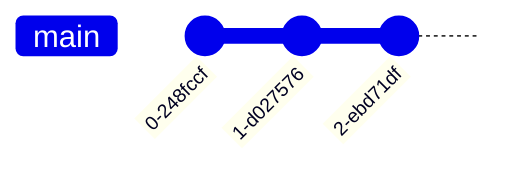

# TPs Formation Git Sogilis

Dépôt d'exercices pratiques complémentaire à la formation Git Sogilis

## Format des TPs

Chaque TP représente un "scénario" d'utilisation de git. Les instructions sont spécifiées dans le README.md des branches correspondantes. Le but est d'utiliser les connaissances du cours pour appliquer ces intructions, les commandes git correspondantes ne sont donc pas directement données. 

En cas de bloquage pas de panique, une solution est disponible via une section dépliable de ce type:

<details>
<summary>Spoiler</summary>

```
git solve-my-problem
```
</details>


## Démarrer un TP

Pour chaque TP, entrez la command ```git checkout tp<n>-main``` pour commencer le TP.

Exemple : pour commencer le TP n°1, entrez
```
git checkout tp1-main
```

Test Gitgraph

End Gitgraph
